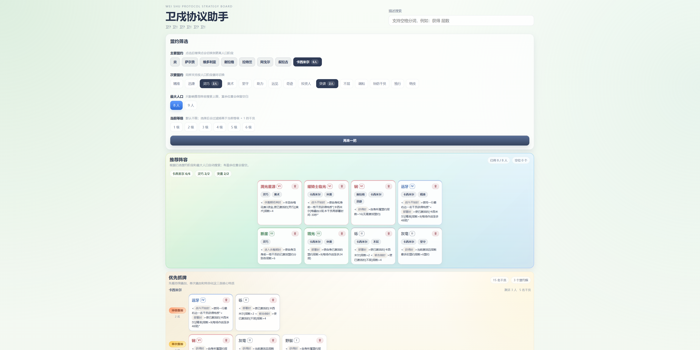

# 卫戍协议助手

<div align="center">
  <p>一个面向《明日方舟》“卫戍协议”模式的盟约筛选与抓牌辅助工具。</p>
  <p>打开即用，优先推荐直接访问在线版。</p>
  <p>
    <a href="https://arknights-weishu-tool.llomin.top"><strong>在线体验</strong></a>
  </p>
  <p>
    
    
    
  </p>
  <p>
    
  </p>
</div>

## 项目简介

把“选盟约 -> 看可用干员 -> 组推荐阵容”这条流程做成了网页工具，以便在卫戍协议对局中快速辅助决策。

重点解决这些问题：

- 已选盟约下，哪些干员值得优先拿
- 当前人口和等级限制下，能不能凑出满足条件的阵容
- 看到某类描述时，如何快速搜索对应干员
- 某些干员这局不想考虑时，如何临时排除再继续看牌

整个项目基于本地静态 JSON 数据驱动，没有后端依赖。

## 功能概述

- 盟约多选筛选，并支持在不同激活人数阶段之间循环切换
- 根据已选盟约、最大人口和当前等级自动计算推荐阵容
- 按特质类别优先展示“优先抓牌”和“其他可选”
- 支持描述分词搜索，关键词命中会高亮
- 支持局内临时移除干员、恢复已删、标记已抓牌
- 在线版打开即用，适合桌面和移动端快速查表

## 使用说明

1. 打开在线版，进入首页后先在“盟约筛选”里点选盟约。
2. 同一个盟约可以连续点击，在不同激活人数阶段之间循环切换；点到最后一次会取消选择。
3. 按当前局势设置“最大人口”和“当前等级”。
4. 页面会自动给出“推荐阵容”，并把可用干员按优先级分成“优先抓牌”和“其他可选”。
5. 如果你想直接查某类效果，可以在“描述搜索”中输入关键词，支持空格分词，例如：`获得 层数`。
6. 某个干员这局不想再看时，点卡片右上角移除；想重新开始时，点“再来一把”。

## 使用小贴士

- 搜索结果区域独立于盟约筛选，适合直接按描述查牌。
- 当前等级开启后，会过滤掉高于“当前等级 + 1”的干员。
- 推荐阵容会根据已选盟约阶段自动搜索；如果条件无法同时满足，页面会直接给出原因。

## 本地运行

### 环境要求

- Node.js 20+
- npm

### 安装依赖

```bash
npm install
```

### 启动开发环境

```bash
npm run dev
```

启动后按 Vite 控制台输出的本地地址访问即可。

<details>
<summary>开发者补充</summary>

### 常用命令

| 命令 | 说明 |
| --- | --- |
| `npm run dev` | 启动本地开发服务器 |
| `npm run build` | TypeScript 检查并打包生产构建 |
| `npm run preview` | 本地预览构建产物 |
| `npm run lint` | 运行 ESLint |
| `npm run test` | 运行 Vitest 单元测试 |
| `npm run test:watch` | 监听模式运行测试 |

### 技术栈

- Vite 7
- React 19
- TypeScript 5
- Zustand
- Zod
- Vitest + Testing Library

### 项目结构

```text
data/   # 本地静态数据
src/    # 页面、领域模型与交互逻辑
tests/  # 纯逻辑测试
```

### 数据说明

- 本项目当前使用 `data/covenants.json` 和 `data/operators.json` 作为本地静态数据源。
- 页面加载时会完成数据标准化与结构校验。
- 如果游戏内容后续更新，数据和相关规则需要同步维护。

</details>
